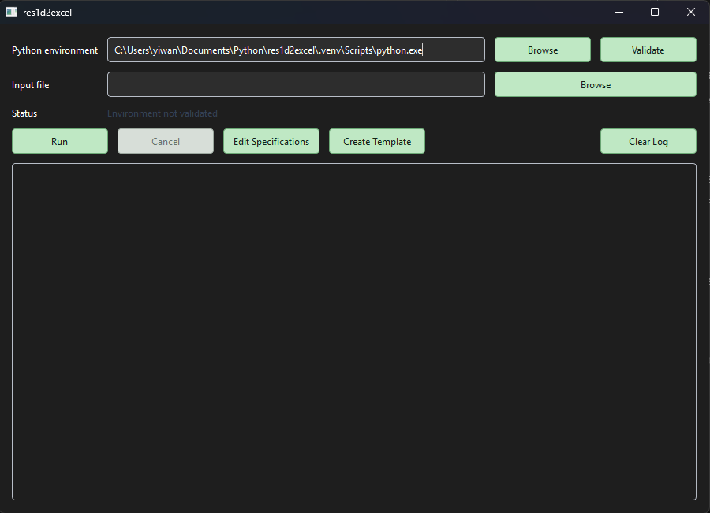
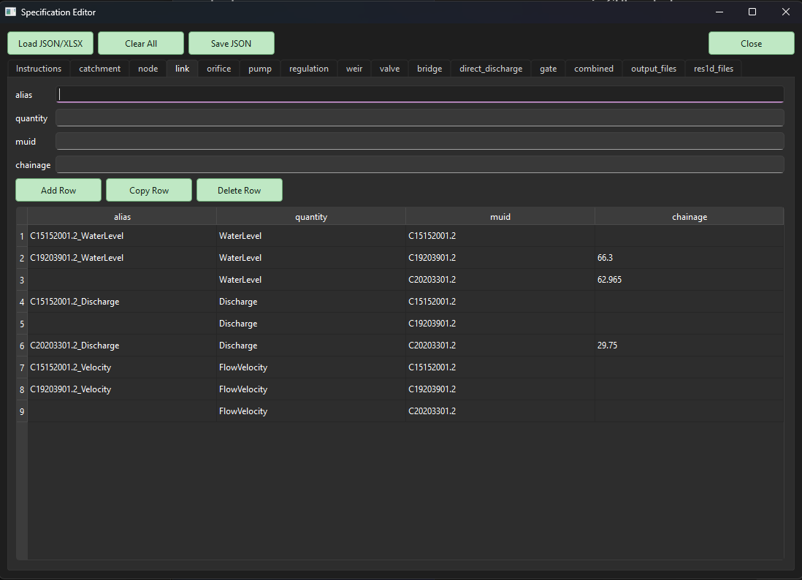
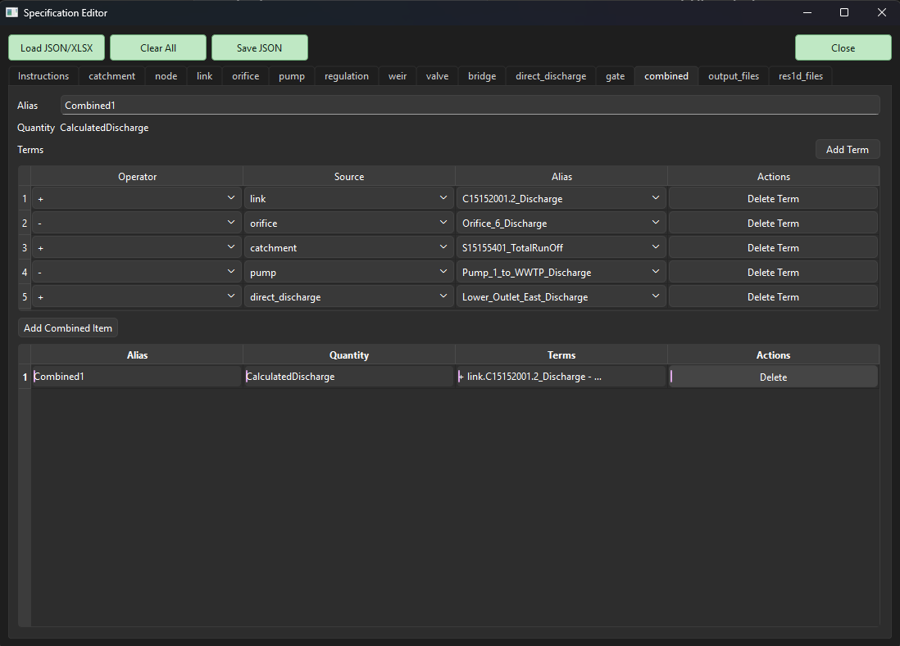

# res1d2excel

`res1d2excel` extracts MIKE 1D and EPANET result data to Excel workbooks and optional interactive Plotly HTML pages.

It can be used from either:

- the command line: `res1d2excel`
- the graphical launcher: `res1d2excel-gui`

## Requirements

- Python 3.13 or newer
- Packages declared in `pyproject.toml`, including `pandas`, `numpy`, `mikeio1d`, `pythonnet`, `openpyxl`, `plotly`, and `PySide6`

## Build The Wheel

```powershell
uv build --wheel
```

The wheel is written to `dist/`, for example:

```text
dist/res1d2excel-2.1.0-py3-none-any.whl
```

The wheel contains the `res1d2excel` package and declares dependencies. It does not include test inputs, test result files, generated Excel files, generated pickle files, or the legacy web editor.

## Install With uv

```powershell
uv pip install dist\res1d2excel-2.1.0-py3-none-any.whl
```

## Install With Conda

Create and activate a Python 3.13 environment, then install the wheel with `pip`:

```powershell
conda create -n res1d2excel python=3.13
conda activate res1d2excel
python -m pip install dist\res1d2excel-2.1.0-py3-none-any.whl
```

After installation, these commands are available:

```powershell
res1d2excel
res1d2excel-gui
```

## Command-Line Use

Create template input files in the current folder:

```powershell
res1d2excel
```

Run an existing JSON or Excel specification:

```powershell
res1d2excel path\to\input.json
res1d2excel path\to\input.xlsx
```

## GUI Use

Start the graphical launcher:

```powershell
res1d2excel-gui
```

The main window provides:

- Python environment selection
- environment validation
- input file selection
- `Run`
- `Cancel`
- `Edit Specifications`
- `Create Template`
- live process log output

The selected Python environment must have `res1d2excel` and its dependencies installed. The validation button checks Python version and required imports.

## GUI Workflows

### Run An Existing Input File Without Editing

1. Start `res1d2excel-gui`.
2. Select a Python environment.
3. Click `Validate`.
4. Select an existing `.json` or `.xlsx` input file in the main window.
5. Click `Run`.

In this case, the GUI runs the selected file directly. It does not create an extra timestamped JSON copy.

### Edit An Existing JSON File

1. Open `Edit Specifications`.
2. Click `Load JSON/XLSX`.
3. Select an existing `.json` file.
4. Edit values in the specification editor.
5. Close the editor or leave it open.
6. Click `Run` in the main window.

Editor changes are passed back to the main window automatically. You do not need to click `Save JSON` before running.

When you run an edited JSON specification, the GUI automatically saves a timestamped copy beside the original JSON file and runs that copy:

```text
test_river.json
test_river_20260902191333.json
```

The original JSON file is not overwritten unless you explicitly choose it in the `Save JSON` dialog.

### Edit An Existing Excel Input File

1. Open `Edit Specifications`.
2. Click `Load JSON/XLSX`.
3. Select an existing `.xlsx` file.
4. Edit values in the specification editor.
5. Click `Run` in the main window.

The Excel file is loaded into the GUI as an in-memory specification. If you run after editing, the GUI saves a timestamped JSON copy beside the Excel file and runs that JSON:

```text
test_collection.xlsx
test_collection_20260902191333.json
```

The Excel file is not modified by the GUI.

### Create A Specification Without Loading A File

1. Open `Edit Specifications`.
2. Enter specification values directly in the editor tabs.
3. Click `Run` in the main window.

Because there is no source file, the GUI saves a timestamped JSON file in the current working folder:

```text
res1d2excel_spec_20260902191333.json
```

The GUI then runs that generated JSON file.

### Save Manually From The Editor

Click `Save JSON` in the specification editor to choose where to save the current settings.

After saving manually, that saved JSON becomes the current source path. Later edited runs will create timestamped copies beside that saved JSON.

### Clear Inputs

Click `Clear All` in the specification editor to reset to an empty valid specification:

- all element tabs empty
- `combined` empty
- `res1d_files` empty
- `output_files` reset to safe defaults
- output options turned off

The cleared specification is passed back to the main window automatically.

## Specification Editor

The specification editor is a second GUI window opened from `Edit Specifications`.

It contains:

- `Instructions` tab first, with collapsible sections
- one tab per element type
- `combined` tab
- `output_files` tab
- `res1d_files` tab

Toolbar buttons outside the tabs:

- `Load JSON/XLSX`
- `Clear All`
- `Save JSON`
- `Close`

Element tabs use table editing. Select a row to edit it in the form above the table. Use `Add Row`, `Copy Row`, and `Delete Row` to manage rows.

The `combined` tab follows the legacy HTML editor pattern:

- add a combined item
- select it in the table
- edit the alias
- add or delete terms
- choose `+` or `-`
- choose a source element type
- choose an alias from that source

## Validation In The GUI

Before running an edited in-memory specification, the GUI checks for common issues:

- missing output folder
- output folder does not exist
- no output type selected
- result rows missing `result_type`, `short_name`, or result file path
- duplicate result short names within the same result type
- missing result files
- combined terms referencing missing aliases
- incomplete element rows

If validation fails, the run does not start.

## Screenshots

Main launcher:



Specification editor link tab:



Specification editor combined tab:



## Test Fixtures

Test inputs are kept under `tests/` and are not included in the wheel.

Collection-system fixtures:

```powershell
uv run res1d2excel tests\test_collection.json
uv run res1d2excel tests\test_collection.xlsx
```

EPANET fixture:

```powershell
uv run res1d2excel tests\test_epanet.json
```

River fixture:

```powershell
uv run res1d2excel tests\test_river.json
```

Some fixtures may emit warnings for requested elements that are not present in the sample result file. The run is still successful if exports complete.

## Input Spreadsheet Format

Use `res1d2excel_template.xlsx` or `res1d2excel_template.json` to specify inputs and outputs.

List element MUIDs under corresponding sheets:

- `catchment`
- `node`
- `link`
- `orifice`
- `pump`
- `regulation`
- `weir`
- `valve`
- `bridge`
- `direct_discharge`
- `gate`

Each element row uses:

```text
alias | quantity | muid
```

`alias` is optional. It is only needed when that element row will be referenced by a combined item.

For links and regulations, include `chainage`:

```text
alias | quantity | muid | chainage
```

Example:

```text
alias           quantity    muid   chainage
CA38_Level      WaterLevel  10149  0
CA38_Discharge  Discharge   10149  15
```

Chainage defaults to zero. Inaccurate chainages are moved to the closest available chainage.

## Result Files

List result files in `res1d_files`.

Columns:

```text
result_type | short_name | res1d_file_path
```

Use:

- `network` for MIKE network result files
- `runoff` for MIKE runoff result files
- `network` for EPANET `.res`, `.resx`, and `.whr` files

Short names are used as output column names or sheet names. Do not duplicate short names within the same result type.

For EPANET `.res` files, keep the matching `.inp` file beside the result file.

## Output Files

In `output_files`, provide a folder to save output files.

Available outputs:

```text
by_elements | by_element.xlsx | time series organized by element
by_file     | by_file.xlsx    | time series organized by result file
stats       | stats.xlsx      | statistics output
```

Do not select `stats` if the result files already contain statistics.

Use `to_html` with `TRUE` or `FALSE` to export interactive Plotly pages:

```text
plots_by_element.html
plots_by_file.html
```

Optional time settings:

- `resample_t`: resample time interval
- `skip_time`: remove time from the beginning of each result
- `trunc_time`: remove time from the end of each result

Examples:

```text
1day
2h
5min
30s
```

## Common Quantities

Catchment quantities include:

```text
NetRainfall, TotalRunOff, SurfaceStorage, OverlandFlow,
OverlandFlowFirstReservoir, OverlandFirstReservoirStorage,
OverlandSecondReservoirStorage, RootZoneStorage, InterFlow,
InterFlowAndBaseFlow, InterFlowFirstReservoir, CapillaryFlux,
InfiltrationToGroundWater, GroundWaterDepth, BaseFlow, LowerBaseFlow
```

Network node quantities include:

```text
WaterVolume, WaterLevel, TotalOutflow, TotalInflow, WaterSpillDischarge
```

Network link quantities include:

```text
WaterLevel, WaterVolume, TotalInflow, TotalOutflow, Discharge,
DischargeVolume, DischargeVolumeNegative, DischargeVolumePositive,
ControlStrategyId, FlowVelocity, DischargeInStructure,
DischargeInStructureVolume, DischargeInStructureVolumeNegative,
DischargeInStructureVolumePositive
```

EPANET node quantities include:

```text
Demand, Head, Pressure, WaterQuality, Volume, Volume Percentage
```

EPANET link quantities include:

```text
Flow, Velocity, HeadlossPer1000Unit, AvgWaterQuality,
StatusCode, Setting, ReactorRate, FrictionFactor
```

EPANET pump quantities include:

```text
Pump efficiency, Pump energy costs, Pump energy
```

Advection-dispersion quantities depend on pollutant name. For a pollutant named `sewage`, examples include:

```text
sewageMass, sewage, sewageTransportMassPositive,
sewageTransportMassNegative, sewageTransport, sewageTransportMass
```
